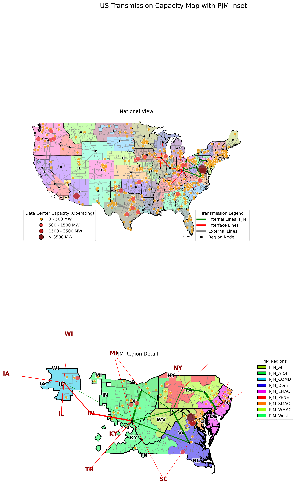
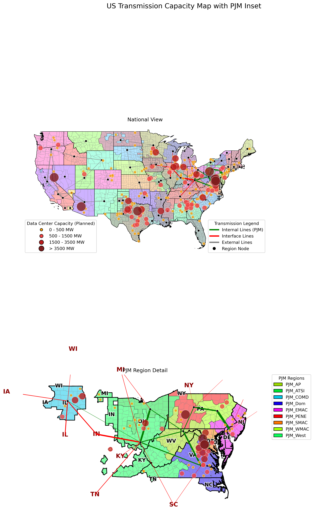
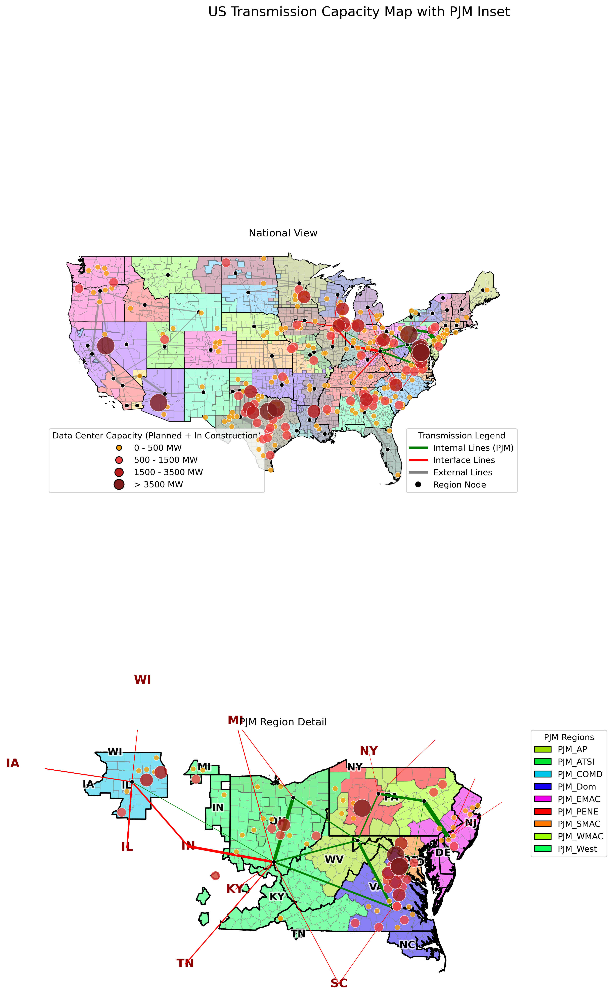
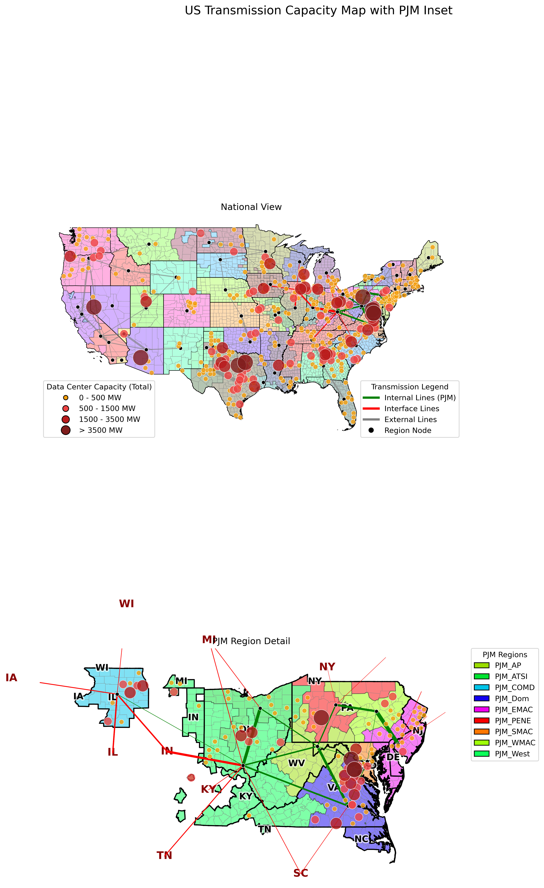

#  ICARUS PJM Dataset

[](https://www.python.org/downloads/)
[](https://opensource.org/licenses/MIT)
[](http://creativecommons.org/licenses/by/4.0/)
[]()

## What is ICARUS?

ICARUS — _Infrastructure Centric Adaptation and Resiliency in the U.S._ — is a joint research initiative between the [**Ralph O’Connor Sustainable Energy Institute (ROSEI)**](https://energyinstitute.jhu.edu/) at [**Johns Hopkins University**](https://www.jhu.edu/), [**NSF Global Center EPICS**](https://energyinstitute.jhu.edu/epics/), and the [**Johns Hopkins Applied Physics Laboratory (APL)**](https://www.jhuapl.edu/work/mission-areas/research-and-exploratory-development), supported by a [**Johns Hopkins Discovery Award**](https://research.jhu.edu/major-initiatives/discovery-awards/2024-awardees/).

ICARUS develops advanced data and modeling tools to strengthen the reliability, safety, and affordability of critical U.S. infrastructure. We focus on high-resolution projections of environmental conditions and other external stressors that affect large-scale infrastructure systems such as electric power, water supply, and transportation networks. By combining state-of-the-art computational and engineering expertise, the project produces actionable insights for planners and operators who must prepare infrastructure for a range of future scenarios—from extreme weather events to changing population patterns and demand surges.

Our goal is to make these improved datasets, algorithms, and case studies publicly available so that researchers, policymakers, and practitioners can better **assess vulnerabilities, plan investments, and enhance the resilience of essential services** nationwide.

## What are ICARUS deliverables?
ICARUS’s immediate goal is to create, release, and maintain datasets that directly inform infrastructure efficiency, reliability, and resiliency across the U.S. Our first priority is the [ICARUS PJM Dataset](data/PJM), a high-resolution, regularly updated resource designed to illuminate some of the region’s most pressing challenges:
 - Data-center integration. Support reliable, just-in-time integration of the unprecedented growth in data centers across Virginia, Maryland, and Pennsylvania. See [WaPo](https://www.washingtonpost.com/business/2025/09/13/big-tech-data-centers-electricity-energy-power-texas-pennsylvania/f7ab00d8-9056-11f0-8260-0712daa5c125_story.html) for more details. 
 - Resource adequacy. Enable deeper analysis of supply capacity shortages that have driven unprecedented capacity price increases in PJM states. See [NYTimes](https://www.nytimes.com/2025/07/23/business/energy-environment/governors-pjm-electric-grid.html) for more details.
 - Policy guidance. Equip policymakers across 13 PJM states and the District of Columbia to steer transmission and generation investments that can contain rapid electricity rate growth. See [WSJ](https://www.wsj.com/finance/investing/higher-electricity-prices-arent-all-good-for-utilities-23113b91?reflink=desktopwebshare_permalink) for more details. 
 - Transmission planning. Provide robust analytics for (inter)state transmission build-out, improving PJM reliability and efficiency while evaluating the “seven” benefits requested under FERC Order No. 1920, including generation of practical worst-case scenarios for resiliency assessments. See [FERC](https://www.ferc.gov/explainer-transmission-planning-and-cost-allocation-final-rule) for more details.

We start with [PJM](https://en.wikipedia.org/wiki/PJM_Interconnection) because it is the largest multi-state, market-based interconnection in the country, spanning diverse generation fleets, load centers, and jurisdictional boundaries. This complexity makes it an ideal proving ground for data tools aimed at strengthening U.S. infrastructure resilience.

## What is the need in ICARUS?
While many modeling and decision-support tools exist (we recommend [GenX](https://github.com/GenXProject/GenX.jl), [HOPE](https://github.com/HOPE-Model-Project/HOPE), [SWITCH](https://github.com/switch-model/switch), [E4ST](https://github.com/e4st-dev/E4ST.jl), and [HAIKU](https://www.rff.org/topics/data-and-decision-tools/haiku-electricity-model/)), there is still no consistent effort to maintain an up-to-date public data set responsive to today’s needs. Our project addresses this gap by providing datasets in all common input formats to maximize usability, keeping time series current, and adding new features as they emerge (for example, few anticipated how challenging data-center modeling would become).
Such efforts are not entirely new, but since the [dissolution of the Breakthrough data team](https://bescdn.breakthroughenergy.org/publications/MacroGridReport.pdf), we have repeatedly heard from stakeholders about the need for publicly maintained and regularly updated data resources. By creating such datasets, and starting with PJM, we aim to enable a wide range of stakeholders to be effective advocates in billion-dollar infrastructure decisions that must be made to keep the PJM grid reliable, efficient, and able to accommodate unprecedented electricity demand growth.

---

## ICARUS: Key Features
* **Ready-to-Use Data**: Cleaned and processed CSV files, compatible with most common models (e.g., [GenX](https://github.com/GenXProject/GenX.jl)).
* **Regional Filtering**: Easily filter the datasets for a specific region (e.g., PJM, MISO) by changing a single variable in the code.
* **Detailed Visualizations**: Generate insightful maps of regional transmission infrastructure and connectivity.
* **Transparent & Reproducible**: Python scripts are provided to show exactly how the raw EPA data was sourced and processed.
* **Documentation**: Full transparency on data sources and processing steps is provided.
* **Extensible**: A clear roadmap supports incorporation of new data, including (extreme) weather impacts, data centers, and FERC 1920 compliance.
* **Community-Driven**: We encourage community input to enhance and refine the datasets.
* **Long-Term Continuity**: As an academic project with a focus on community build-out, we are well-positioned to ensure long-term maintenance and growth.

## Dataset Comparison (Preliminary)

This table provides a high-level comparison of this dataset with other common public datasets.

## How does ICARUS compare?

| Dataset                              | Granularity (Spatial)          | Format         | Primary Focus                                                                 |
| ------------------------------------ | ------------------------------- | ------------------------------- | ----------------------------------------------------------------------------- |
| **ICARUS Dataset (This repo)**   | **Regional/Zonal (PJM & beyond)** | **CSV, Parquet** | **Generates input datasets for capacity expansion models in basic and standard formats** |
| **[PUDL (Public Utility Data Liberation)](https://catalyst.coop/pudl/)** | Plant & utility-level (U.S.)   | SQLite, Parquet, CSV            | Integrates EIA/FERC data on fuel, generation, costs, and emissions for analysis |
| **[PowerGenome](https://github.com/PowerGenome/PowerGenome)**                      | Regional (IPM regions, user-defined) | SQLite, CSV, Parquet            | Generates input datasets for capacity expansion models (e.g., GenX)     |


## One-Click Downloads

For convenience, pre-processed datasets for common regions are available for direct download.

  * [**Download PJM Dataset (Base)**](data/PJM)
  * [**Download PJM Dataset in GenX format**](data/GenX_PJM_9zones)<sup>†</sup>  

<sup>†</sup> This version is a simplified, hard-coded conversion of the [**PJM Dataset (Base)**](data/PJM) into the [**GenX**](https://github.com/GenXProject/GenX.jl) format, following examples from the official [GenX repository](https://github.com/GenXProject/GenX.jl). In addition to EPA’s base load profiles, it integrates **planned** and **in-construction data center loads** into the total demand profiles. This version does **not** explicitly model cross-regional transmission interfaces, which can be approximated by representing **outgoing flows as generators** (see [`generators_interface.csv`](data/PJM/generators_interface.csv)) and **incoming flows as loads** (see [`load_interface.csv`](data/PJM/load_interface.csv)).

### Future Enhancements

We plan to expand the repository's scope to include emerging challenges and regulatory changes in the power sector.

| Feature Area             | Description                                                               | Target      |
| ------------------------ | ------------------------------------------------------------------------- | ----------- |
| **Data Center Loads** | Incorporate state- and regional-level projections for data center demand.    | `Available`      |
| **Downscaled Atmospheric Data** | Integrate other weather (year) data to model (extreme) weather impacts.     | `Soon`      |
| **FERC Order 1920 Compliance** | Model transmission expansion scenarios based on the new FERC rule.  | `Soon`      |
| **State/Utility representation** | Enhanced resolution to consider state/utility-level impacts.  | `Soon`      |
| **Nodal representation** | Enhanced resolution to consider more detailed transmission network.  | `Soon`      |

---
## About the Data

### Data Procurement & Processing

The power system data is sourced directly from the **[U.S. EPA Power Sector Modeling: 2023 Reference Case](https://www.epa.gov/power-sector-modeling/2023-reference-case)** documentation and associated data files.

The Python script (`make_data.py`) in this repository perform the following key tasks:
1.  Load the raw Excel files provided by the EPA Power Sector Modeling platform.
2.  Clean and standardize column names and data formats.
3.  Reshape time-series data (like load and renewable generation profiles) from wide to long format.
4.  Apply the specified regional filter.
5.  Save the processed data into clean, easy-to-use CSV files.


The Data Center Loads are sourced from the **[U.S. DOE NREL Speed to Power Initiative](https://maps.nrel.gov/speed-to-power/?vL=6834e82591241decedd4ef8c%2C682746c9d58843cf7876093e%2C6838ae2891241decedd4ef8f%2C685c736d77a7c73f0a473a5d&b=%5B%5B-130.500647%2C25.796786%5D%2C%5B-56.785252%2C50.844826%5D%5D)**.
The aggregated dataset for the contiguous United States (CONUS) is provided in [`load_datacenter_all.csv`](data/load_datacenter_all.csv), while region-specific subsets (e.g., for PJM) are located within their respective folders under `data`, such as [`load_datacenter.csv`](data/PJM/load_datacenter.csv).

* [ ] More details to follow for 1) Downscaled Atmospheric Data and 2) FERC Order 1920 Compliance.

#### Renewable Energy (RES) Data Structure

The renewable generation data is stratified by several "class" types, which is crucial for detailed modeling:

  * **Wind/Solar Class**: Represents the quality of the resource site. For wind, this corresponds to mean wind speed bands (1 = best), and for solar, it relates to solar irradiance levels.
  * **Resource Class**: A finer subdivision of potential within a primary Wind/Solar Class, often linked to capacity slices or Levelized Cost of Energy (LCOE).
  * **Cost Class**: An additional stratification by cost adders, such as those for transmission access or challenging siting conditions.

-----

### Generated Data Files

When you run the script with a `REGION_PREFIX` (e.g., "PJM"), the following files are generated under `data/PJM/`:

| File Name                             | Description                                                              |
| ------------------------------------- | ------------------------------------------------------------------------ |
| `generators.csv`                      | List of active power plants in the region.                               |
| `generator_retirements_by_2028.csv`   | List of generators scheduled for retirement by 2028.                     |
| `load.csv`                            | Hourly load profiles for each sub-region.                                |
| `lines.csv`                           | Internal transmission lines within the region.                           |
| `generators_interface.csv`            | Transmission import capacity from other regions.                         |
| `load_interface.csv`                  | Transmission export capacity to other regions.                           |
| `wind_onshore.csv`                    | Hourly generation profiles for onshore wind, stratified by class.        |
| `wind_offshore_fixed.csv`             | Hourly generation profiles for fixed-bottom offshore wind.               |
| `wind_offshore_floating.csv`          | Hourly generation profiles for floating offshore wind.                   |
| `solar.csv`                           | Hourly generation profiles for solar PV, stratified by class.            |

-----

### Raw and Extracted Data

Not all tables listed in the [Documentation for EPA’s Power Sector Modeling Platform 2023 Using the Integrated Planning Model 2023 Reference Case](https://www.epa.gov/system/files/documents/2025-02/epa-2023-reference-case.pdf) are provided as spreadsheets in the [Documentation for 2023 Reference Case](https://www.epa.gov/power-sector-modeling/documentation-2023-reference-case).
To ensure completeness, we manually extracted the missing tables and saved them as CSV files in [`rawdata/epa-2023-reference-case`](rawdata/epa-2023-reference-case).
For convenience and to serve as a one-stop repository, we also included the original spreadsheets that were already available from the [Documentation for 2023 Reference Case](https://www.epa.gov/power-sector-modeling/documentation-2023-reference-case).

Due to file size limitations, the folder [`rawdata/epa-2023-reference-case`](rawdata/epa-2023-reference-case) does **not** include the IPM v6 Regions shapefiles.
Please manually download [`ipm_v6_regions.zip`](https://www.epa.gov/sites/production/files/2019-08/ipm_v6_regions.zip) and place it inside that directory.

| Parameter                           | Source Document Tables                        |
| ----------------------------------- | --------------------------------------------- |
| Renewable Portfolio Standards (RPS) | 3-18                                          |
| State RPS Solar Carve-outs          | 3-19                                          |
| Clean Energy Standards (CES)        | 3-20                                          |
| Offshore Wind Mandates              | 3-21                                          |
| Fossil Generation Limits (GWh)      | 3-22                                          |
| Life Extension Costs                | 4-10                                          |
| Performance & Unit Costs            | 4-12, 4-15                                    |
| VOM Assumptions                     | 4-8                                           |
| FOM Assumptions                     | 4-9                                           |
| Short-term Capital Cost Adders      | 4-13                                          |
| Regional Cost Factors (RF)          | 4-14                                          |
| Potential RES Capacity (MW)         | 4-16, 4-17                                    |
| Reserve Margin Contribution         | 4-20, 4-21, 4-22, 4-26, 4-31                  |
| Capital Cost Adders (CCA)           | 4-23, 4-24                                    |
| Potential Non-powered Dam           | 4-29                                          |
| Energy Storage Mandates             | 4-33                                          |


-----

## How-To Manual: Getting Started

### 1. Download the Data & Code

Clone this repository to your local machine:
```bash
git clone https://github.com/HopkinsICARUS/ICARUS-PJM-Dataset.git
cd ICARUS-PJM-Dataset
```

### 2. Set Up Your Environment
Install the required Python packages:

```bash
pip install numpy pandas geopandas matplotlib
```

### 3. Run the Processing Scripts

To generate the dataset, run the main data processing script from your terminal, making current directory where Python scripts are located:

```bash
python make_data.py 
```

_Note_: You can easily filter the entire datasets for a specific region other than the default, PJM. Open the `make_data.py` script and modify the `REGION_PREFIX` variable:
  * **For a specific region:** `REGION_PREFIX = "PJM"` (default) or `REGION_PREFIX = "MIS"`
  * **For the complete US dataset:** `REGION_PREFIX = ""`

When a prefix is set, the filtered data will be saved in a dedicated subfolder (e.g., `data/PJM/`).

## Regional Transmission Visualization

The included Python scripts can generate detailed maps of the **EPA IPM regions** and their transmission interconnections, with clear distinctions between the region of interest and its neighboring regions. This map can be generated by running `python plot_network.py`

The example map below was generated by setting **`REGION_PREFIX = "PJM"`**, which highlights:  

- **Internal Lines (Green):** Transmission corridors within the PJM territory.  
- **Interface Lines (Red):** Corridors connecting PJM to neighboring regions.  
- **External Lines (Grey):** All other transmission lines in the U.S. model.  


## Regional Transmission Visualization With Datacenter Loads

The repository also includes visualization scripts to overlay **data center load capacities** on top of the EPA IPM regional transmission network.
This enhanced map can be generated by running:

```bash
python plot_network_datacenter.py
```

The script allows users to choose which category of data center loads to display using the parameter:

```python
# Options: "Planned", "Operating", "In Construction", "Planned + In Construction", "Total"
DC_CAPACITY_TO_PLOT = "Planned"
```

When **`REGION_PREFIX = "PJM"`** is set, the resulting maps display the PJM regional boundaries, internal and interface transmission lines, and data center loads according to the selected status.

### Example Visualizations

* **Operating Datacenter Loads:**
  

* **In-Construction Datacenter Loads:**
  

* **Planned Datacenter Loads:**
  

* **Planned + In-Construction Datacenter Loads:**
  

* **Total Datacenter Load (MW):**
  

-----
